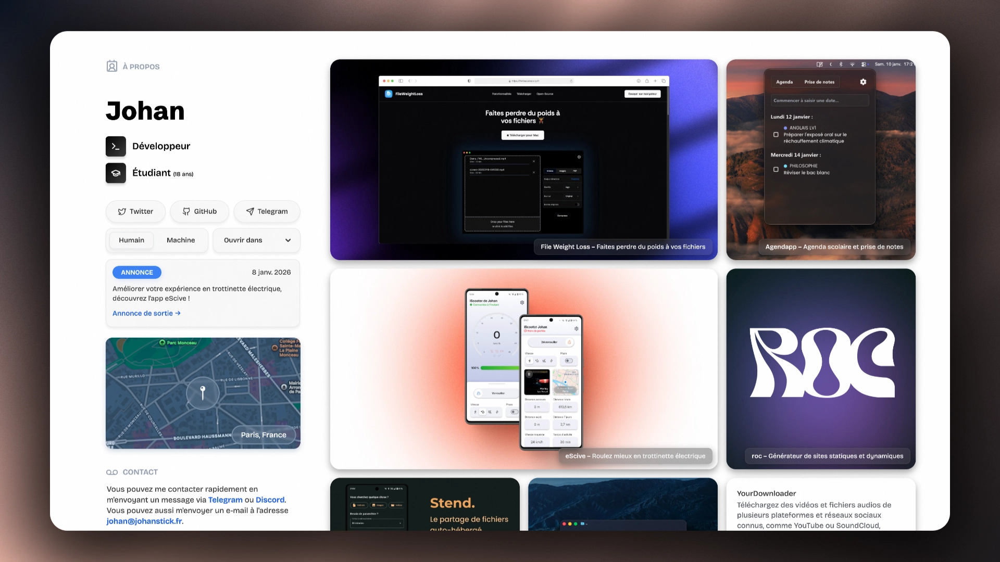

###### English version [here](https://github.com/johan-perso/portfolio/blob/main/README.md).

# Portfolio v4 ⇢ Johan

[](https://johanstick.fr/fr/portfolio-v4/)
*cliquez sur l'image pour accéder au site et lire un article de blog qui explique le développement de celui-ci*

## Installer localement

```bash
git clone https://github.com/johan-perso/portfolio.git
cd portfolio

bun install
bun run scripts/compileContent.js
bun run dev

# compiler avec:         bun run build
# compiler/servir avec:  bun run start
```

## Stack

- [Tailwind CSS](https://tailwindcss.com)
- [Roc Framework](https://github.com/johan-perso/roc-framework)
- [Bun](https://bun.sh)
- [Obsidian](https://obsidian.md) et [Obsidian GitPush](https://github.com/johan-perso/obsidian-gitpush) (pour la rédaction de contenu)

## Licence

MIT © [Johan](https://johanstick.fr). [Soutenez ce projet](https://johanstick.fr/#donate) si vous souhaitez m'aider 💙