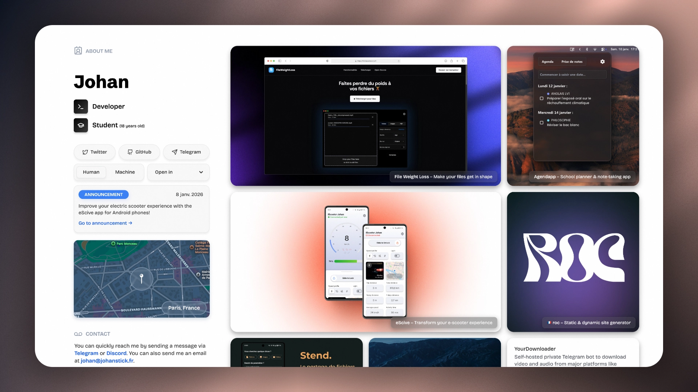

###### Version française [ici](https://github.com/johan-perso/portfolio/blob/main/README.fr.md).

# Portfolio v4 ⇢ Johan

[](https://johanstick.fr/en/portfolio-v4/)
*click the image to see a live version + a blog post that explains the development process*

## Setup locally

```bash
git clone https://github.com/johan-perso/portfolio.git
cd portfolio

bun install
bun run scripts/compileContent.js
bun run dev

# build with:          bun run build
# build & serve with:  bun run start
```

## Stack

- [Tailwind CSS](https://tailwindcss.com)
- [Roc Framework](https://github.com/johan-perso/roc-framework)
- [Bun Runtime](https://bun.sh)
- [Obsidian](https://obsidian.md) and [Obsidian GitPush](https://github.com/johan-perso/obsidian-gitpush) plugin (for content writing)

## License

MIT © [Johan](https://johanstick.fr/). [Support this project](https://johanstick.fr/#donate) if you want to help me 💙